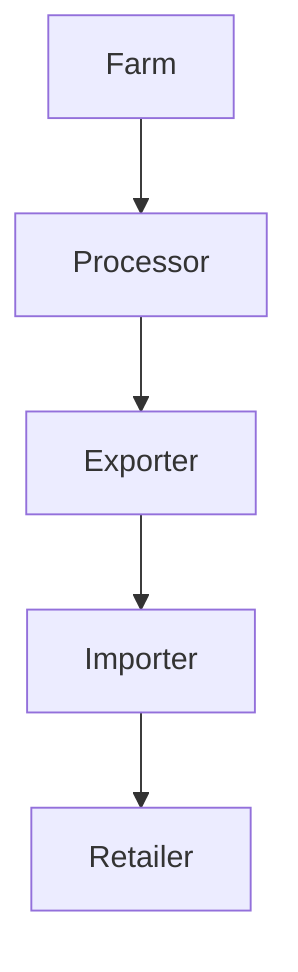

# Blockchain Beyond Bitcoin: Real-World Applications

Blockchain is more than just the technology behind Bitcoin. Today, it's revolutionizing industries from supply chain to healthcare.

## Key Use Cases

- **Supply Chain Transparency**: Track goods from origin to shelf with immutable records.
- **Healthcare**: Secure patient data and streamline medical records.
- **Voting Systems**: Enable tamper-proof digital voting.

> "Blockchain is the tech. Bitcoin is merely the first mainstream manifestation of its potential."  
> — Marc Kenigsberg

### Example: Tracking Coffee Beans

**Learn more:** [Blockchain in Supply Chain](https://www.ibm.com/blockchain/solutions/supply-chain) 